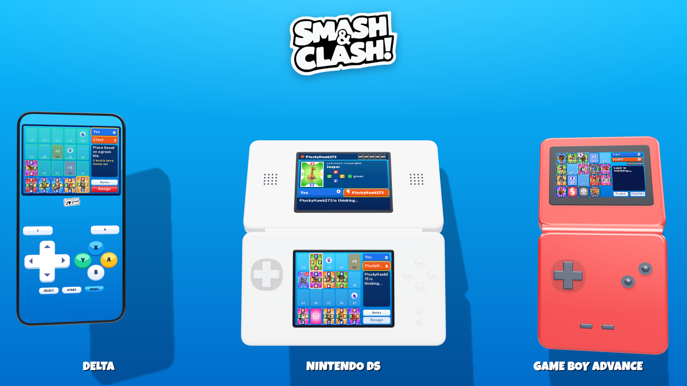
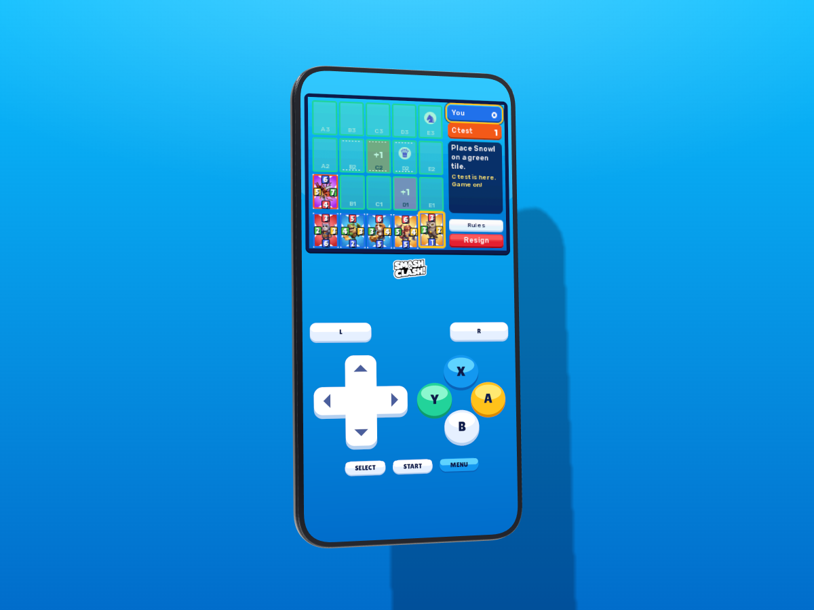
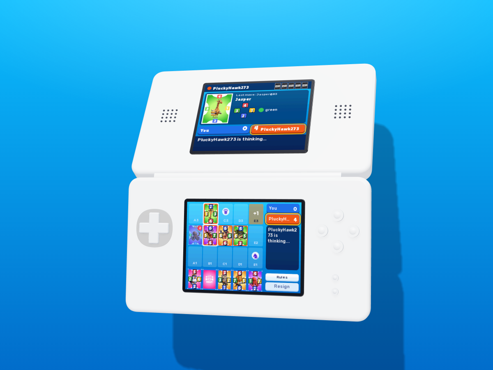
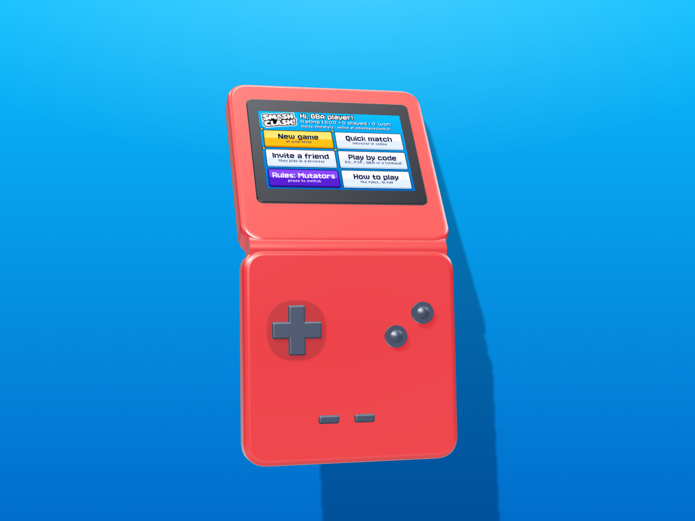
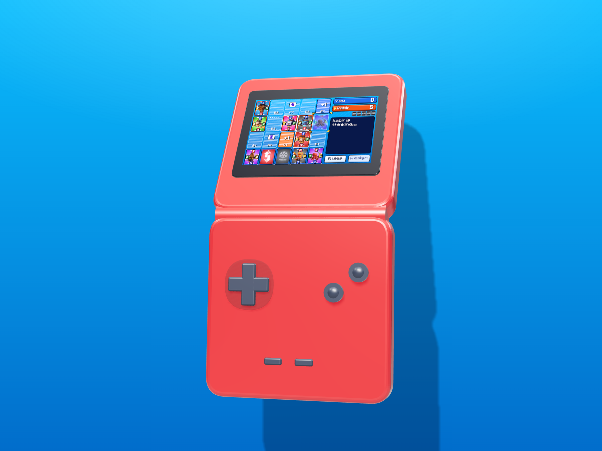
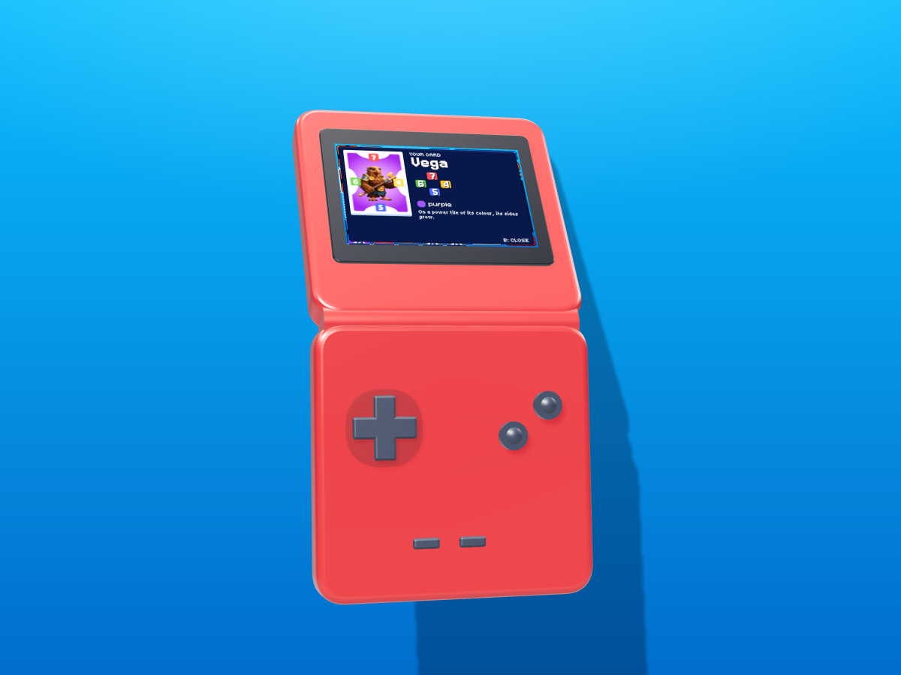
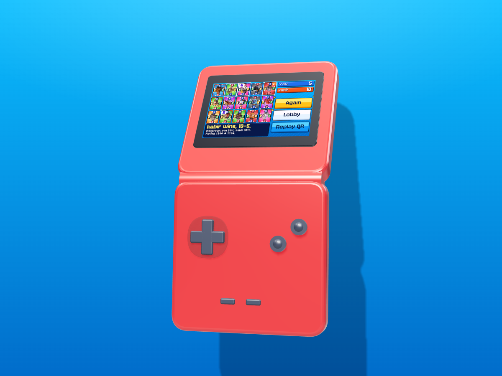
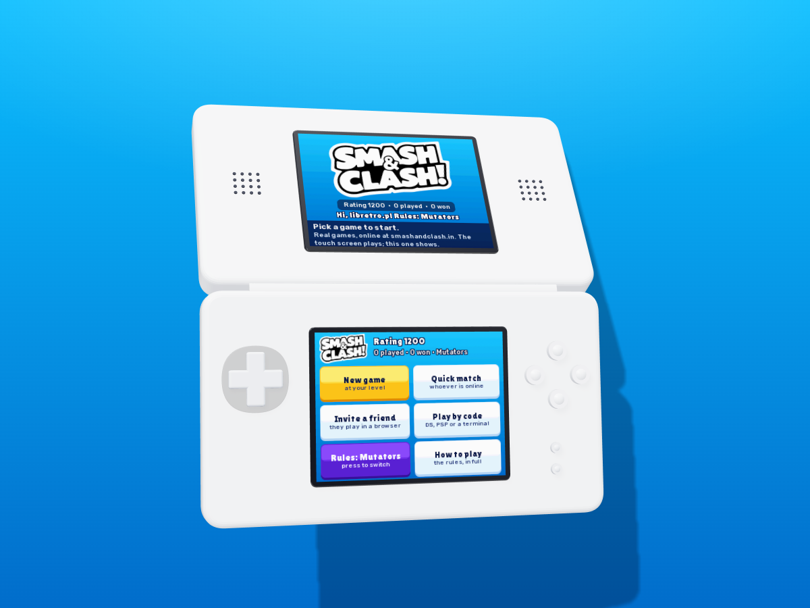
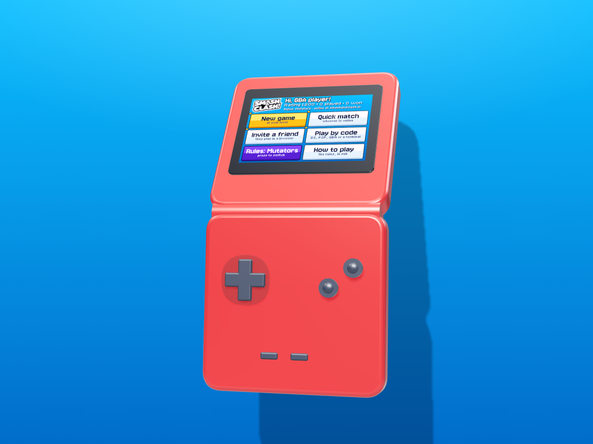

<div align="center">

# Smash&Clash on Delta, DS and GBA

**Smash&Clash, playable online on retro handhelds: a Nintendo DS game for [Delta](https://faq.deltaemulator.com), melonDS and real hardware, plus a Game Boy Advance game that plays through the official [Smash&Clash SDK](https://docs.smashandclash.in).**

Real games against real people and the house opponent, on smashandclash.in's servers. Same rules, same cards, same Game Review as [smashandclash.in](https://www.smashandclash.in).



**[⬇ Download the DS game, the GBA game and the Delta skins (v1.0.0)](https://github.com/smashandclash/delta/releases/latest)**

**Build your own client today: [docs.smashandclash.in](https://docs.smashandclash.in)**

</div>

---

The Smash&Clash SDK lets you build your own Smash&Clash client on anything. This repo is the proof on 20-year-old handhelds: a DS cartridge that speaks HTTPS to the game's API on its own, and a GBA cartridge with no network at all that plays through the SDK anyway.

Looking for the PSP? It has its own repo, with a GPU-drawn 3D board: **[smashandclash/ppsspp](https://github.com/smashandclash/ppsspp)**.

## Contents

- [What's in here](#whats-in-here)
- [Play on the DS in Delta](#play-on-the-ds-in-delta)
- [Play on the GBA in mGBA](#play-on-the-gba-in-mgba)
- [Screenshots](#screenshots)
- [How to play](#how-to-play)
- [The sound](#the-sound)
- [How it works](#how-it-works)
- [The SDK, call by call](#the-sdk-call-by-call)
- [Build it yourself](#build-it-yourself)
- [Tests: real games, headless](#tests-real-games-headless)
- [Build your own client](#build-your-own-client)
- [Troubleshooting](#troubleshooting)
- [Links](#links)

## What's in here

| Path | What it is |
| --- | --- |
| [`ds/`](ds) | **The Nintendo DS game** (C, [BlocksDS](https://blocksds.skylyrac.net)). Wi-Fi, TLS and the whole game on the touch screen; the top screen is a bonus. |
| [`gba/`](gba) | **The Game Boy Advance game** (C, [Wonderful](https://wonderful.asie.pl) + libtonc). A retro take on the Arena Pop look: pixel fonts, hard edges, sprite cursor. |
| [`gba/bridge/`](gba/bridge) | **The SDK bridge** the GBA plays through: an mGBA Lua script and a Node script on [`@smashandclash/sdk`](https://www.npmjs.com/package/@smashandclash/sdk). |
| [`ds/audio/`](ds/audio), [`gba/audio/`](gba/audio) | **Each console's own soundtrack and effects**, encoded for its sound hardware ([`tools/audio/`](tools/audio) made them). |
| [`skins/`](skins) | **Delta controller skins**: the DS touch screen alone, big, like a GBA SP (iPhone and iPad, portrait and landscape), and a matching GBA skin. |
| [`core/`](core) | The shared C core: an HTTPS keep-alive client (mbedTLS), the SDK's calls in C, the client's state machine, D-pad navigation and a 16-bit software renderer. |
| [`tools/`](tools) | Builds the art from the real game (cards, logo, fonts), the Delta skins, and the TLS root certificates. |
| [`tests/`](tests) | Headless emulator tests that play full online games: melonDS for the DS, mGBA (through the real SDK bridge) for the GBA. |
| [`host/`](host) | Desktop builds of the core: an API smoke test and screen previews that play a live game and save every screen. |
| [`docs/`](docs) | [How it works](docs/how-it-works.md) and [build your own client](docs/build-your-own-client.md). |

## Play on the DS in Delta

You need [Delta](https://faq.deltaemulator.com) 1.7 or later on iPhone or iPad (it plays DS games online through melonDS) and an internet connection.

1. Download **`smashandclash.nds`** from the [latest release](https://github.com/smashandclash/delta/releases/latest) and import it into Delta (the **+** button).
2. Download **`smashandclash-ds.deltaskin`**, open it in Delta, then choose it under **Settings → Controller Skins → Nintendo DS**. It shows the touch screen alone, big, so a phone feels like a GBA SP.
3. Start the game. The first time, Delta asks you to **choose a WFC server**: pick any one (Wiimmfi works), tap **Done** and restart the game.

That is all. Smash&Clash never talks to the WFC server: Delta only needs one chosen to turn the Wi-Fi on. The game then connects to smashandclash.in itself, over TLS. BIOS files are optional.

**melonDS** (Windows, macOS, Linux): open `smashandclash.nds`; the Wi-Fi works out of the box. **A real DS**: set up a connection in any Wi-Fi game's settings first (a DS in DS mode joins open or WEP networks).

## Play on the GBA in mGBA

The GBA has no network, so the GBA game reaches the game through the **SDK bridge**: an mGBA script carries each SDK call from the cartridge's RAM to a Node script on your computer, which makes it with `@smashandclash/sdk`. You need [mGBA](https://mgba.io) 0.10 or later and [Node.js](https://nodejs.org) 18 or later.

1. Download **`smashandclash.gba`** and **`smashandclash-gba-bridge.zip`** from the [latest release](https://github.com/smashandclash/delta/releases/latest), and unzip the bridge.
2. In the bridge folder: `npm install`, then `node bridge.mjs`. It listens on `127.0.0.1:8765`.
3. Open `smashandclash.gba` in mGBA, then **Tools → Scripting… → File → Load script… → `smashandclash.lua`**.

The game's boot screen ticks off both steps and goes to the lobby as soon as the SDK is on the line. Your record (rating, rules, the game in progress) is kept in the cartridge's battery save. Delta cannot run the bridge (it has no scripting), so in Delta, play the DS game.

## Screenshots

| | |
| :---: | :---: |
|  |  |
| **In Delta**, with the one-screen skin: the touch screen holds the whole game. | **Both DS screens.** The top shows the card you are looking at, the score and what to do next. |
|  |  |
| **The GBA lobby.** New game at your level, Quick match, Invite a friend, Play by code, Mutators or Classic. | **A GBA game.** Real card art at 28 × 38, the printed side values, mint for where your card can go. |
|  |  |
| **SELECT** looks at a card up close: its art, its four sides, its colour, what an effect does. | **Game over.** The result, both players' Game Review accuracy and your new rating; SELECT shows the replay as a QR code. |
|  |  |
| **The DS lobby.** Your name is the console's nickname. | **The GBA boot screen**, once the mGBA script and the SDK bridge are both up. |

## How to play

Smash&Clash is a two-player game on a 3 × 5 board. Each player holds 5 cards and plays one per turn.

- **Characters** have four side values (1–7). Place one on an empty tile and it attacks each neighbour that faces the other player: if your touching side is at least theirs, that card turns to you. When all 15 tiles are full, whoever has more cards facing them wins.
- **Effects** (Boulder!, Flip!, Freeze!, Recruit!, Swap!) play when they can do something.
- **Mutators** (the default rules) add chess tiles (hop like a knight, bishop, rook or queen), power tiles (+1/+2 for a colour) and overrun zones. **Classic** turns them off.

You are always blue and the other side orange, whichever seat you hold. **New game** plays an opponent at your level; **Quick match** pairs you with whoever is online; **Invite a friend** shows a QR code a phone opens in its browser; **Play by code** hosts or joins a 6-letter duel code, so a DS, a GBA, a PSP and a terminal (`npx smashandclash duel join CODE`) can all play each other.

| | DS | GBA |
| --- | --- | --- |
| Pick a card, then a green tile | tap them, or D-pad + **A** | D-pad + **A** |
| Put the card back | **B** | **B** |
| Your next playable card | **L** / **R** | **L** / **R** |
| The contextual button (Stay, Play Flip!) | **Y** | its button |
| How to play | **X** | the Rules button |
| Look at a card up close | the top screen | **SELECT** |
| Replay QR (after a game) | **SELECT** | **SELECT** |
| Resign (press twice) | **START** | **START** |
| Sound on or off (in the lobby) | **START** | **START** |

## The sound

Each console has its own original soundtrack and effects, made with [ElevenLabs](https://elevenlabs.io) for that console the way its screens are: a lobby theme, a game theme, a win and a lose jingle, and eight effects (the cursor, picking, backing out, a card landing, a capture, your turn, a "not allowed" and the game starting).

| | DS | GBA |
| --- | --- | --- |
| **Sound** | bright handheld pop: marimba, glockenspiel, slap bass | pocket chiptune: pulse-wave leads, triangle bass, noise drums |
| **Played by** | the DS's sound hardware: themes as IMA-ADPCM looping in hardware, effects as 8-bit PCM, 16384 Hz | DirectSound: 8-bit PCM at 13379 Hz fed by DMA, the theme on channel A and effects on B |

The themes loop seamlessly: [`tools/audio/make_audio.py`](tools/audio/make_audio.py) cuts each one on the bar, a whole number of bars long, lined up by cross-correlation and crossfaded at the seam. What plays when is shared by every console ([`core/snc_sound.c`](core/snc_sound.c)): the lobby theme in menus and waiting rooms, the game theme in a game, a jingle at the end. The headless tests record the emulator's audio and check it against the themes, including that a theme loops. **START** in the lobby turns the sound off (and on again); the game remembers.

## How it works

Both games are written in C on one shared core, the same one the PSP game uses:

```
 ds/source/main.c ─┐                               ┌─ snc_http.c  mbedTLS, keep-alive  ──▶ smashandclash.in
 gba/source/main.c ┼─▶ snc_client ─▶ snc_api ──────┤
 (input, drawing)  │   (state, jobs) (SDK calls)   └─ gba/source/bridge.c ─▶ RAM mailbox ─▶ mGBA script ─▶ bridge.mjs (@smashandclash/sdk)
                   └─▶ view.c + snc_ui + snc_gfx (each console's screens, one renderer)
```

1. **`snc_api`** is the SDK's calls in C, named the way `@smashandclash/sdk` names them (`games.startHouse`, `game.play`, `game.waitForTurn`, …), reading the API's JSON with jsmn into a `snc_game`: the board in your frame, your hand with its printed sides, the special tiles and `legalMoves`.
2. **`snc_client`** is the whole client minus the drawing: screens, what is picked, notices, the player's record, and **one network job at a time** with a short queue behind it. The UI never blocks: it hands a job over and keeps drawing; a long wait for the other player is cut short when you act.
3. **Each console draws its own screens** (`ds/source/view.c`, `gba/source/view.c`) with the shared renderer and records its touch and focus targets, so the touch screen, the D-pad and the buttons all end up in the same `view_press`.
4. **The DS** runs the network on a cooperative thread (dswifi + lwIP): TLS 1.2/1.3 with mbedTLS, Let's Encrypt roots built in, and a DNS fallback to 1.1.1.1 over UDP for Delta's WFC DNS servers that do not resolve the API host.
5. **The GBA** builds the same calls with `-DSNC_BRIDGE`: each one is written into a mailbox in its RAM, and the mGBA script and `bridge.mjs` make it with the real SDK and write the answer back. While a call is out, the cartridge keeps running frames, so the screen and the buttons stay alive.

The parts, the GBA's mailbox format, the drawing for either seat and the gotchas are in **[docs/how-it-works.md](docs/how-it-works.md)**.

## The SDK, call by call

Every feature is one SDK call. On the DS the C core makes it over HTTPS; on the GBA the bridge makes it with `@smashandclash/sdk` itself:

| In the game | SDK (`@smashandclash/sdk`) | C core |
| --- | --- | --- |
| **New game** (an opponent at your level) | `sc.games.startHouse({ name, as: 'person', ruleset, strength })` | `snc_start_house` |
| **Quick match** | `sc.games.quickMatch({ name, as: 'person', opponent: 'any' })` | `snc_quick_match` |
| **Invite a friend** (the QR code) | `sc.games.createDuel({ name, as: 'person', opponent: 'person' })` → `game.inviteUrl` | `snc_create_invite` |
| **Play by code: Host** | `sc.games.createDuel({ name, as: 'person' })` → `game.code` | `snc_host_code` |
| **Play by code: Join** | `sc.games.joinDuel(code, { name, as: 'person' })` | `snc_join_code` |
| Play a card | `game.play('Pengu@C2')` | `snc_play` |
| Wait for the other side | `game.waitForTurn(20)` (a long poll) | `snc_wait` |
| **Resign / Cancel** | `game.resign()` | `snc_resign` |
| Their hand once the deck is out | `game.sync({ since })` → `state.opponentHand` | `snc_opponent_hand` |
| **How to play** | `sc.rules()` | `snc_rules` |
| Game over: accuracy | `sc.games.review(id)` | `snc_review` |
| Switch the console off mid-game | `sc.games.resume(id, playerToken)` | `snc_refresh` |
| Replay QR | `game.replayUrl` | `snc_game.replay_url` |

```js
// gba/bridge/bridge.mjs: what the GBA's calls turn into
import { SmashAndClash } from '@smashandclash/sdk'
const sc = new SmashAndClash()

case 'games.startHouse': return started(await sc.games.startHouse({ name, ruleset, strength, as }))
case 'game.play':        return (await gameFor(id, token)).play(body.move)
case 'game.waitForTurn': return (await gameFor(id, token)).waitForTurn(20)
```

The full API, including hosting matches between two people, spectating and replays, is at **[docs.smashandclash.in](https://docs.smashandclash.in)**.

## Build it yourself

Everything builds on Linux (or WSL). The art is made from the real game the first time you build: the 51-card deck and its art from the API, the logo from smashandclash.in, and the fonts from Google Fonts (cached in `tools/cache/`). You need Python 3 with `pip install pillow fonttools`.

```bash
# the DS game: BlocksDS with mbedTLS (wf-pacman -S blocksds-toolchain blocksds-mbedtls)
make -C ds                 # -> ds/smashandclash.nds

# the GBA game: Wonderful with the GBA target (wf-pacman -S target-gba target-gba-libtonc)
make -C gba                # -> gba/smashandclash.gba

# the Delta skins
python3 tools/make_deltaskin.py skins

# desktop previews against the live API (gcc + mbedTLS 3): every screen as an image
sh host/build.sh && ./build/host/gba_preview build/shots
```

`tools/make_certs.mjs` refreshes the built-in root certificates (`core/snc_certs.h`) from `tools/roots.pem`. The sound is committed, ready to build (`ds/audio/`, `gba/audio/`); [`tools/audio/gen.mjs`](tools/audio/gen.mjs) holds the prompts it was made from (it needs an ElevenLabs API key to make new takes) and [`tools/audio/make_audio.py`](tools/audio/make_audio.py) encodes them (numpy and ffmpeg).

## Tests: real games, headless

Both tests boot the game in a real emulator core with no window, play a full online game against the house opponent by pressing buttons like a person, read what is on screen from the game's own state line, and save screenshots along the way.

```bash
pip install libretro.py pillow
# DS: the melonDS DS core, with its built-in BIOS and emulated access point (as in Delta)
python3 tests/ds_play.py ds/smashandclash.nds build/ds-test
# GBA: the mGBA core; the test does the Lua script's job, through the real SDK bridge
(cd gba/bridge && npm install && node bridge.mjs &)
python3 tests/gba_play.py gba/smashandclash.gba build/gba-test
```

## Build your own client

A DS cartridge is one surface. The same calls work for a Discord bot, a terminal, a game engine, a smartwatch or something nobody has thought of yet. **[docs/build-your-own-client.md](docs/build-your-own-client.md)** is the checklist: the state you get, move names, drawing the board from either seat, effects, hops and overruns, waiting, errors and rate limits, and fair play. Start at **[docs.smashandclash.in](https://docs.smashandclash.in)**.

## Troubleshooting

- **DS: "No Wi-Fi connection"** in Delta. Turn on online play for DS games, choose a WFC server when Delta asks (any one), and restart the game.
- **DS: "The secure connection could not start"**: the console's clock is far in the past or the network blocks HTTPS. The game skips certificate dates when the clock reads before 2026, so check the network first.
- **GBA: stuck on "Connecting to the SDK bridge…"**: the boot screen says which half is missing. Load `smashandclash.lua` in mGBA's scripting window, and keep `node bridge.mjs` running.
- **GBA: "The SDK bridge is not running"** mid-game: the Node script stopped. Start it again; the game picks up where it was.
- **Same Wi-Fi, two consoles.** Play by code works across any networks: both consoles talk to smashandclash.in, never to each other.

## Links

- **Docs and API: [docs.smashandclash.in](https://docs.smashandclash.in)**
- Play: [smashandclash.in](https://www.smashandclash.in)
- SDK on npm: [`@smashandclash/sdk`](https://www.npmjs.com/package/@smashandclash/sdk)
- The PSP game: [smashandclash/ppsspp](https://github.com/smashandclash/ppsspp)
- On a tldraw board: [smashandclash/tldraw](https://github.com/smashandclash/tldraw)
- OpenAPI 3.1: [smashandclash.in/openapi.json](https://www.smashandclash.in/openapi.json)
- The terminal client: `npx smashandclash`

## License

The code in this repo (the DS and GBA games, the bridge, the core, tools and tests) is MIT licensed; see [LICENSE](LICENSE). It includes [jsmn](https://github.com/zserge/jsmn) (MIT) and [QR Code generator](https://www.nayuki.io/page/qr-code-generator-library) by Project Nayuki (MIT). The fonts the build downloads are under the SIL Open Font License (Jersey, Bitcount, Tiny5, Lilita One, Rubik, Noto) and Apache 2.0 (Luckiest Guy). The Smash&Clash game, its rules, characters, artwork, audio and other assets are proprietary and are not licensed here: the build fetches the card art and logo from smashandclash.in, and the released ROMs carry them by permission of Smash&Clash.
